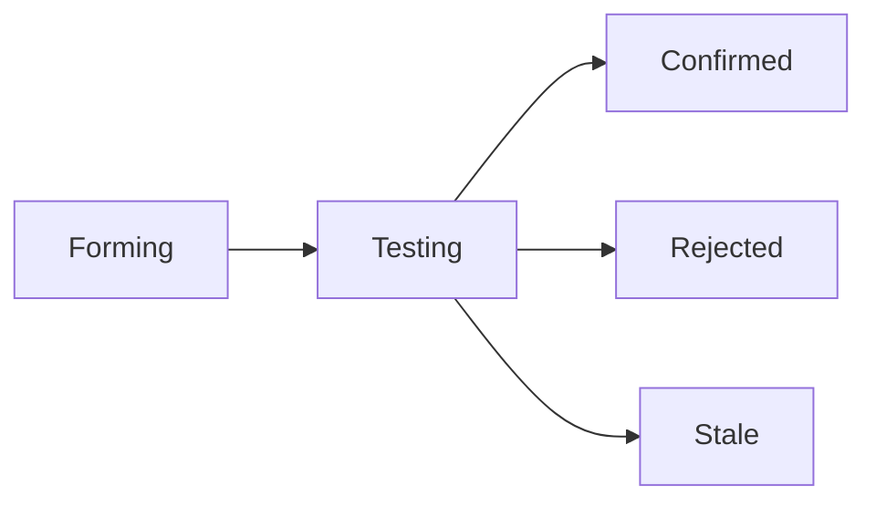

# Intelligence Module Patterns

Intelligence modules sit above calculation modules in the GUTTERS architecture. They consume, synthesize, and query data from multiple calculation modules.

## The Intelligence Ecosystem

The intelligence layer follows a clear functional hierarchy:
1. **The Analyst (Observer)**: Detects raw patterns and correlations in historical data.
2. **The Scientist (Hypothesis)**: Transforms findings into testable claims with a confidence lifecycle.
3. **The Guide (Synthesis)**: Narrates confirmed theories into a unified profile.
4. **The Oracle (Query)**: Answers direct questions using all of the above.

## Architecture Overview

```
┌─────────────────────────────────────────────────┐
│              Intelligence Layer                  │
│  ┌──────────────┐  ┌───────────────┐            │
│  │  Synthesis   │  │     Query     │            │
│  │   Module     │  │    Module     │            │
│  └──────┬───────┘  └───────┬───────┘            │
│         │                  │                     │
│         ▼                  ▼                     │
│  ┌──────────────────────────────────┐           │
│  │        ModuleRegistry            │           │
│  │ (auto-registration via BaseModule)│          │
│  └──────────────┬───────────────────┘           │
└─────────────────│───────────────────────────────┘
                  │
┌─────────────────▼───────────────────────────────┐
│              Calculation Layer                   │
│  ┌──────────┐  ┌──────────┐  ┌──────────┐       │
│  │ Astrology│  │   HD     │  │Numerology│       │
│  └──────────┘  └──────────┘  └──────────┘       │
└─────────────────────────────────────────────────┘
```

---

## ModuleRegistry Integration

Every module auto-registers via `BaseModule.__init__`. Intelligence modules consume this registry.

### Getting Modules
```python
from src.app.modules.registry import ModuleRegistry

# Get all registered modules
all_modules = ModuleRegistry.get_all_modules()

# Filter by layer
calc_modules = ModuleRegistry.get_all_calculation_modules()
intel_modules = ModuleRegistry.get_all_intelligence_modules()

# Get specific module
astro = ModuleRegistry.get_module("astrology")

# Get modules that have calculated data for a user
calculated = await ModuleRegistry.get_calculated_modules_for_user(user_id, db)

# Get user's profile data from a specific module
astro_data = await ModuleRegistry.get_user_profile_data(user_id, db, "astrology")
```

### Auto-Registration (Happens Automatically)
```python
# In BaseModule.__init__:
if self.name:
    from src.app.modules.registry import ModuleRegistry
    ModuleRegistry.register(self)
```

---

## Intelligence Module Directory Structure

```
modules/intelligence/{module_name}/
├── __init__.py          # Re-exports
├── manifest.json        # Module metadata + LLM config
├── module.py            # Inherits BaseModule
├── schemas.py           # Pydantic models
├── {brain}.py           # Core logic (synthesizer.py, engine.py)
└── tests/
    ├── __init__.py
    └── test_{module}.py
```

---

## Synthesis Module Pattern

Aggregates data from all calculation modules into unified profile.

### manifest.json
```json
{
  "name": "synthesis",
  "layer": "intelligence",
  "subscriptions": ["module.profile_calculated"],
  "provides": ["unified_profile"],
  "llm": {
    "default_tier": "premium",
    "temperature": 0.7
  }
}
```

### synthesizer.py (Hierarchical Pattern)

Large intelligence modules should use a hierarchical or "Master/Worker" pattern to manage complexity.

```python
from src.app.core.llm.config import get_premium_llm, get_standard_llm, LLMTier

class ProfileSynthesizer:
    def __init__(self, tier: LLMTier = LLMTier.PREMIUM):
        self.tier = tier
        self._llm = None
    
    @property
    def llm(self):
        # Lazy load to avoid circular dependency at instantiation
        if self._llm is None:
            from src.app.core.llm.config import LLMConfig
            self._llm = LLMConfig.get_llm(self.tier)
        return self._llm

    async def synthesize_profile(self, user_id, db):
        # 🚩 CRITICAL: Deferred imports to avoid circular dependencies
        from .module_synthesis import ModuleSynthesizer
        from app.modules.registry import ModuleRegistry
        from app.core.memory.active_memory import get_active_memory
        
        # 1. Initialize workers
        worker = ModuleSynthesizer(self.llm)
        memory = get_active_memory()
        await memory.initialize()
        
        # 2. Gather diverse data (Parallel possible)
        astro_data = await memory.get_module_output(user_id, "astrology")
        hd_data = await memory.get_module_output(user_id, "human_design")
        
        # 3. Layered synthesis
        astro_insights = await worker.synthesize_astrology(astro_data)
        
        # 4. Master synthesis pass
        prompt = self._build_master_prompt(astro_insights, ...)
        synthesis = await self.llm.ainvoke(prompt)
        
        # 5. Cache & Publish
        await memory.set_master_synthesis(user_id, synthesis)
        return synthesis
```

---

## Query Module Pattern

Answers natural language questions by searching relevant modules.

### engine.py Pattern
```python
class QueryEngine:
    async def answer_query(self, user_id: int, question: str, db: AsyncSession):
        # 1. Classify which modules are relevant
        relevant_modules = await self._classify_question(question)
        
        # 2. Get calculated modules that match
        calculated = await ModuleRegistry.get_calculated_modules_for_user(user_id, db)
        matching = [m for m in relevant_modules if m in calculated]
        
        # 3. Build context from matching modules
        context = await self._build_context(user_id, matching, db)
        
        # 4. Generate answer with LLM
        answer = await self._generate_answer(question, context)
        
        return QueryResponse(
            answer=answer,
            modules_consulted=matching,
            confidence=self._calculate_confidence(context, matching)
        )
    
    async def _classify_question(self, question: str) -> list[str]:
        """Use LLM to determine which modules are relevant."""
        prompt = f"""Which systems are relevant to answer: "{question}"?
        Options: astrology, human_design, numerology
        Return JSON array only: ["system1", "system2"]"""
        
        try:
            response = await self.llm.ainvoke([...])
            return self._parse_json_list(response.content)
        except Exception:
            # Fallback: consult all
            return ["astrology", "human_design", "numerology"]

---

## Pattern Detection & Correlation Pattern (The Observer)

Intelligence modules that detect trends across time and cosmic events.

### Statistical Tools
These modules typically use `scipy` and `numpy` for correlation analysis:
```python
import numpy as np
from scipy import stats

# Calculate Pearson correlation between Kp index and reported headache
correlation, p_value = stats.pearsonr(kp_values, symptom_scores)
```

### Finding Storage
Findings are stored in `UserProfile.data['observer_findings']` and cached in Redis for fast access during synthesis.
```

---

## Hypothesis & Theory Pattern (The Scientist)

The "Scientist" pattern takes anonymous findings from the Observer and turns them into testable self-knowlege theories.

### The Theory Lifecycle


1. **Forming**: Generated from Observer findings (Confidence 0.4 - 0.6).
2. **Testing**: Accumulating evidence from journal entries or cosmic events (Confidence 0.6 - 0.85).
3. **Confirmed**: High confidence (0.85+), becomes part of the permanent Profile.
4. **Rejected**: Contradicted by data (Confidence < 0.4 + contradictions).
5. **Stale**: No new evidence in 60 days.

### Confidence Update Rule
Use a simple weighted update to avoid over-sensitivity:
```python
# Supporting evidence (+5%)
hypothesis.confidence = min(hypothesis.confidence + 0.05, 1.0)
# Contradictory evidence (-10%)
hypothesis.confidence = max(hypothesis.confidence - 0.10, 0.0)
```

### Integration Points
- **Genesis Refinement**: Hypotheses can be queried to provide "Refinement Hints" (e.g., "The user may be a 4:30 AM birth based on solar sensitivity").
- **StateTracker**: Hypotheses contribute to the "Self-Discovery" domain progress.

---

## Multi-Model User Preferences

Store and retrieve user's preferred LLM model.

### Storage Location
```python
# In UserProfile.data['preferences']['llm_model']
{
    "astrology": {...},
    "human_design": {...},
    "preferences": {
        "llm_model": "anthropic/claude-sonnet-4.5"
    }
}
```

### Helper Functions
```python
async def get_user_preferred_model(user_id: int, db: AsyncSession) -> str:
    """Get user's preferred LLM model or default."""
    result = await db.execute(
        select(UserProfile).where(UserProfile.user_id == user_id)
    )
    profile = result.scalar_one_or_none()
    
    if profile and profile.data:
        prefs = profile.data.get("preferences", {})
        model = prefs.get("llm_model")
        if model in ALLOWED_MODELS:
            return model
    
    return DEFAULT_MODEL

async def update_user_preference(
    user_id: int, 
    key: str, 
    value: Any, 
    db: AsyncSession
):
    """Update a user preference in UserProfile.data."""
    result = await db.execute(
        select(UserProfile).where(UserProfile.user_id == user_id)
    )
    profile = result.scalar_one_or_none()
    
    if not profile:
        raise ValueError(f"No profile for user {user_id}")
    
    if not profile.data:
        profile.data = {}
    
    if "preferences" not in profile.data:
        profile.data["preferences"] = {}
    
    profile.data["preferences"][key] = value
    flag_modified(profile, "data")
    await db.commit()
```

---

## API Endpoint Pattern

Intelligence modules expose endpoints under `/api/v1/intelligence/`.

```python
from fastapi import APIRouter, Depends
from src.app.api.dependencies import get_current_user, async_get_db

router = APIRouter(prefix="/intelligence", tags=["intelligence"])

@router.post("/profile/synthesis")
async def trigger_synthesis(
    current_user: Annotated[dict, Depends(get_current_user)],
    db: Annotated[AsyncSession, Depends(async_get_db)],
    model: str | None = None,  # Optional override
):
    user_id = current_user["id"]
    
    # Get model (override > preference > default)
    if model and model in ALLOWED_MODELS:
        model_id = model
    else:
        model_id = await get_user_preferred_model(user_id, db)
    
    synthesizer = ProfileSynthesizer(model_id=model_id)
    result = await synthesizer.synthesize_profile(user_id, db)
    return result
```

---

## Checklist

- [ ] Inherits `BaseModule` with `layer = "intelligence"`
- [ ] Uses `ModuleRegistry` to access calculation module data
- [ ] Implements `contribute_to_synthesis()` (even if empty for query-only modules)
- [ ] Has `_fallback_*` methods for LLM failures
- [ ] Stores user preferences in `UserProfile.data['preferences']`
- [ ] API endpoints have auth dependencies
- [ ] Tests patch `get_llm` at module import location
- [ ] **Circular Safety:** Uses deferred imports inside `synthesize_profile` or similar core methods
- [ ] **High Fidelity:** Tested with deterministic seed data via `SeedDataGenerator`

---

## Key Imports

```python
# Always use src.app prefix from project root
from src.app.modules.registry import ModuleRegistry
from src.app.modules.base import BaseModule
from src.app.core.llm.config import get_premium_llm, get_standard_llm
from src.app.models.user_profile import UserProfile
```
